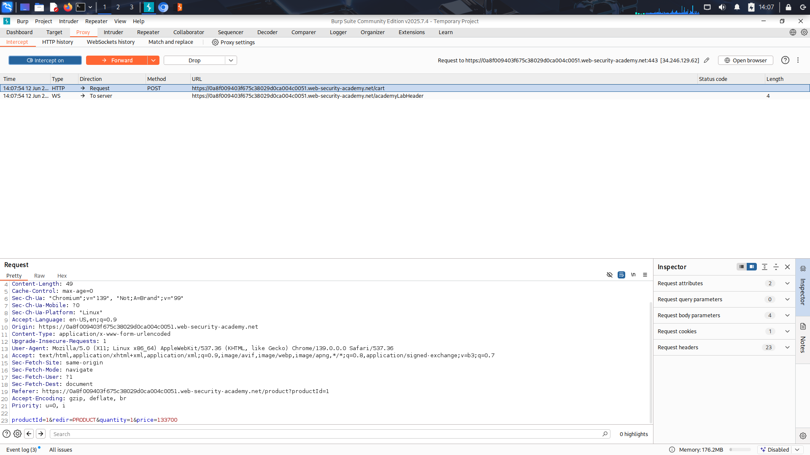
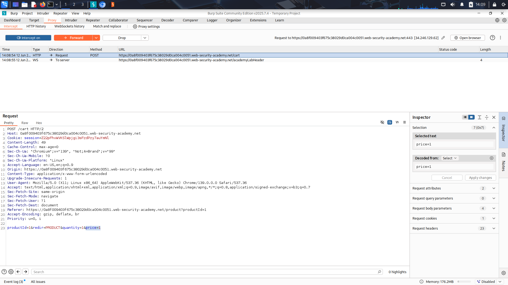
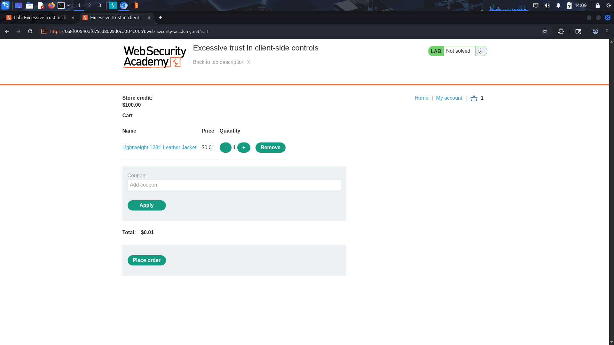

# Excessive trust in client-side controls(Example Lab)

## Objective 
Exploiting the application input validation system to purchase an item at lower price.

## Recon & Observations
- Online shop with 3 pages - home, account, cart.
- Username: wiener - Password: peter.
- The request contains 4 parameter that controls adding to cart - productId, redir, quantity, price

- #### Websites trust on the parameters that client sends.
- Our target is Buying a coat(price: 1337$ - user credit: 100$)

## Exploitation Steps
1. Added the item to the cart.

2. Interpted the request with burp.

3. Indntified the params for every product.

4. Changed `price` parameter to 1.

5. Forwarded the modified request to application.

6. Purchased the item using the manipulated price.

## Result
Successfully modified production price and completed purchase for less price.

## Remediation
- Never trust client-side values for sensitive operations.
- Validate all pricing information on the server side.
- Store product prices in a trusted backend database and calculate totals server-side.

## Lesson Learned
- client-side controls Should Not be the identifier for sensetive values such as price.
- burp can be used as a packet modifier for requests.
 