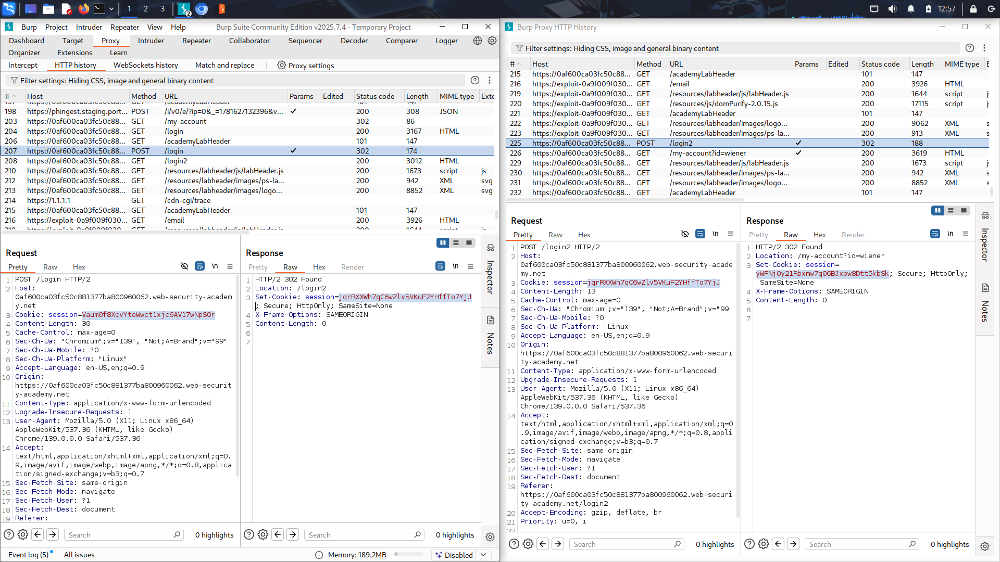
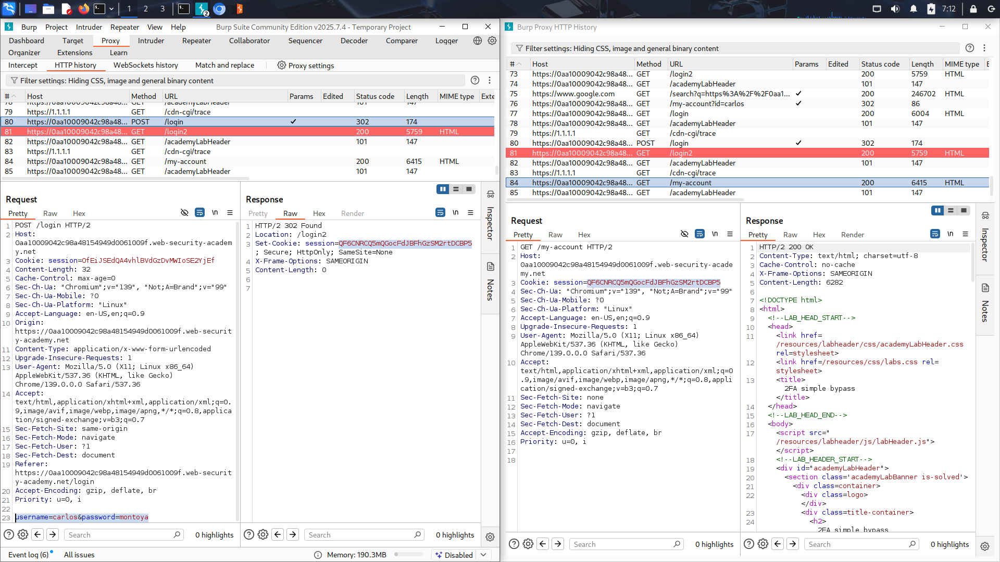

# 2FA Simple Bypass

## Objective
Gain access to someone's account with their username and password, without having access to their mails (Bypassing the 2FA mechanism).

## Recon & Observations
- The application uses two-step authentication with password and a Code sended by mail.

- After submiting username and password to /login page, it redirected to /login2 to enter verification code.

- Application sets a cookie after checking user and pass.

- I checked cookies after entering user and pass to /login with cookies after entering the 2FA code to /login2 but THEY WERE 
DIFFRENT.

- After /login2 server redirects to /my-accoount with `?id=<username>`

## Exploitation Steps

### 1. Login as wiener
Logged in as weiner(provided account) to check authentication flow.

```
POST /login
↓
302 Redirect + set-cookie
↓
GET /login2
↓
Submit 2FA Code + set-cookie(new cookie)
↓
GET /my-account
```

### 2. Analyze Session Behavior

Captured the request and respond using burp after sending authentication query.  


As we can see the application checkes username and password and then sends cookie, also after checking 2FA code sends a new cookie.


### 3. Login as Carlos

```
POST /login
```

The application issued a valid session cookie and redirected the user to:

```
/login2
```

### 4. Bypass the 2FA Step

Instead of compliting the second login, I simply changed `/login2` to `/my-account?id=carlos`.
Sience we already have a cookie from apllication, when we request `/my-account?id=carlos`, server knows who we are.



### 5. Access Granted

The server returned the account page without verifying the 2FA.

---
## Why This Happened?

There is a big  problme in application authentican. \
Usually in 2FA verification application checks user/pass AND verification code like this:
```
authenticated = true
2fa_verified = true
```
Then server sends a final cookie in which user can access the account.\
\
If user tries to get a page like `/my-account` with:
```
authenticated = true
2fa_verified = false
```
Application should not sends the page becouse the verification phase is not complete and the user's cookie is not a valid cookie.

## Result

Successfully accessed carlos's account without providing a valid 2FA code.

The application trusted the authenticated session created after the first authentication step and failed to enforce completion of the second factor.

## Security Impact

An attacker with valid credentials can bypass the 2FA mechanism and gain unauthorized access to user account.

This reduces the effectiveness of multi-factor authentication and account security.

## Remediation

- Maintain a separate authentication state for users who have not completed 2FA.

- Validate the 2FA completion status on every protected request.

- Do not treat username/password authentication as fully authenticated until the second factor succeeds.

## Lessons Learned

- Implementing a 2FA page alone does not provide security.
- Authentication and 2FA states must be tracked separately.
- Access control decisions should verify both primary authentication and second-factor completion.