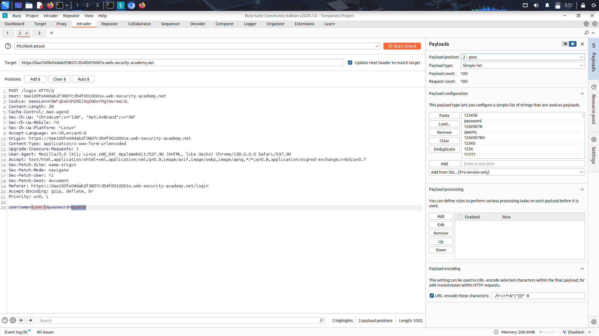
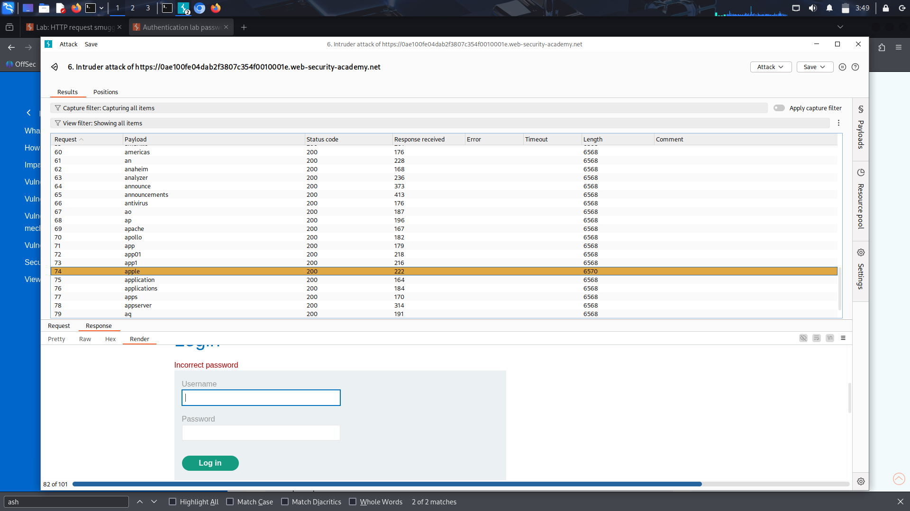
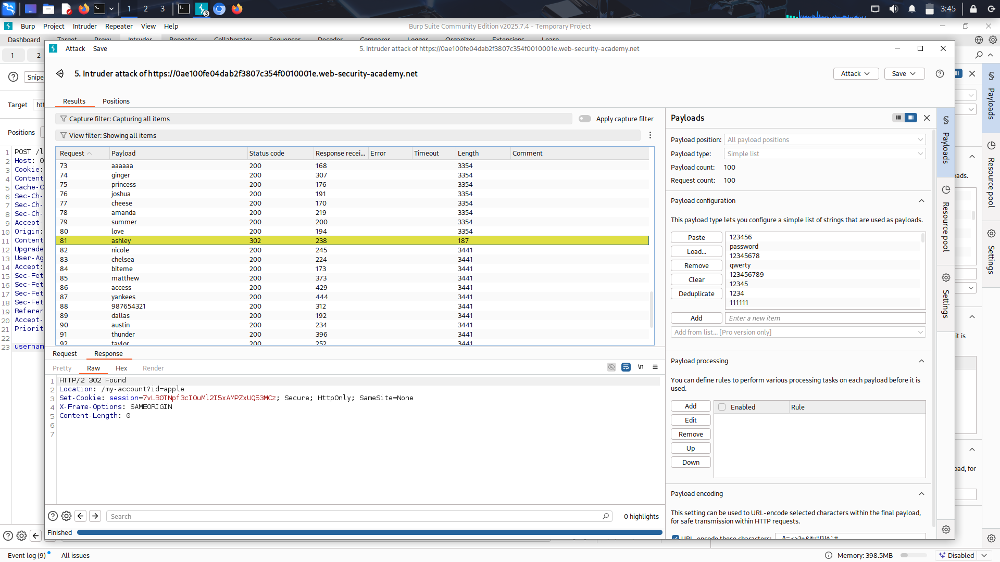

 # Username enumeration via different responses

## Objective 
Finding Username & Password in a vulnerable login system 

## Recon & Observations
- Blog website with a "/login" page.
- Username type & name in request: "username" and Password : "password".
- Have a dictionary list for username/password so we can perform a brute-force.
- #### Site responds to wrong username with "Invalid username" and if the username is correct but password is not with "Invalid password".

## Exploitation Steps
1. I checked other directory in site like account, admin, ... . /account redirecterd me to /login.

2. Captured the login request using Burp Suite and compared response lengths for different usernames.

3. Used intruder and pasted only the usernames to find existed username with checking the response length(invalid password was longer).

4. Used the found username and tried dictionary attack with given passwords.

5. Correct password responses with a diffrent content-length.

## Result
Successfully found a valid username and discovered the password through dictionary attack, Authentication bypassed, Access granted.

## Lesson Learned
- Username and password invalidation message should be the same.
- Authentication systems should implement rate limiting.
- Using burp Intruder, Sniper and Cluster boomb attacks.